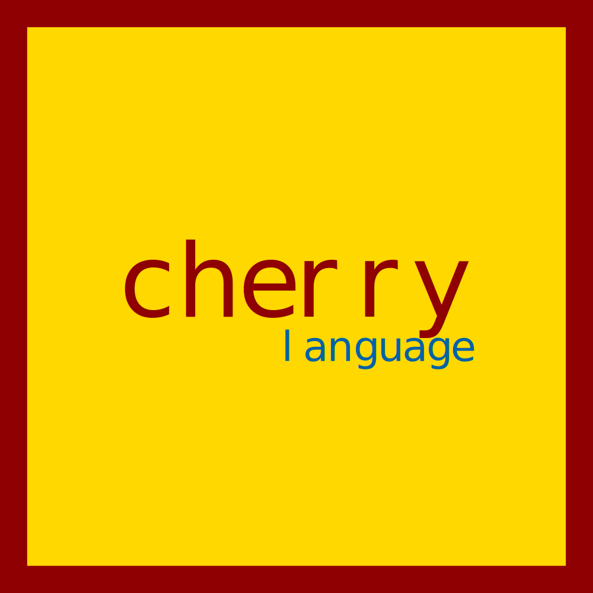

<p align="center">
    
</p>

<p align="center">
    
    
    
</p>

## The Project
Cherry is a weakly statically typed, type safe, memory managed programming language inspired by both TypeScript and Rust.  Cherry's goals are:

- To be type and memory safe
- To eliminate as much implicity as reasonably possible
- To be extremely fast, like Rust, C and C++

Now, here's what Cherry's goals *aren't*:

- Cherry is not intended to be "the easiest programming language to learn."  It will never be the easiest programming language to learn.  In fact, it's one of Cherry's side goals to be a decent challenge to use, but not to the point of being a pain.  For example, Rust is a decently difficult programming language to learn, but it provides amazing error messages and documentation to help point you in the right direction.  It's like a puzzle, not meant to be agonizing to use, but enough challenge to not be completely boring.

## Project Checklist
> **note:** This section will be removed when the project is past the alpha and beta stages.
- 🗹 The lexer.
- 🗷 The diagnostic system.
- 🗷 The parser.
- 🗷 The code generator.

## Examples
> **note:** It is not guaranteed that these examples will work when Cherry is finished, as its syntax may change.

### Hello, world!
```cherry
export function main() {
    println("Hello, world!");
}
```